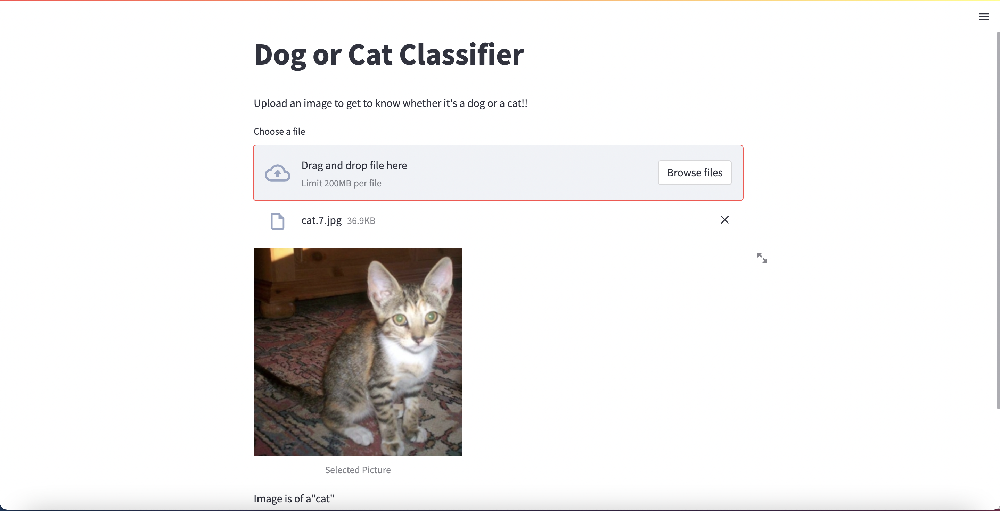

# Building and Deploying a Convolutional Neural Network with TrueFoundry

## TrueFoundry

The primary vision for TrueFoundry is to automate the parts in the machine learning pipeline and empower the machine learning engineers and data scientists to test models in production and reduce dependencies on other teams. TrueFoundry provides you with a dashboard to track your experiments, model configurations, and deploy them with ease.

Through this repo, our aim is to build a full-fledged Streamlit application where we will be experimenting with our CNN, deploying the model as a service, building a Streamlit application, and finally deploying it, all with the help of TrueFoundry.

We will be building a <b> Cat vs Dog Classifier </b>, and make sure to have an API key before you get started with building.

### Setup


* Clone the Repository using:
```
git clone https://github.com/chanakya1310/CNN-with-TrueFoundry.git
```

* Setup and activate a virtual environment

* Install the packages using:
```
pip3 install -r requirements.txt
```

### Building a CNN Locally

The first step is to develop a CNN for the task locally, and the code for that can be found in the train folder. In order to run the file, use the command:
```
python3 train_local.py
```

### Model Training and Experiment Tracking with TrueFoundry

In order to train the model and track your hyper-paramaters along with the evaluation metrics for each model training(or a run), we can use TrueFoundry. A single run represents a single experiment or a single machine learning model that we have trained. The code for the same can be found in the training folder. Make sure to replace your API Key at the appropriate position. Run the file using the command:
```
python3 train.py
```

### Deploying the model as a Service

A service is a continuously running process with an API to interact with it. The resources can be scaled according to the API traffic. To deploy a service, make sure to create a new workspace and keep the workspace FQN handy. I have used FastAPI to develop the API for this particular task.

The code for deploying the model as a service can be found in the 'infer_realtime' folder. It's always better to test the service locally before finally deploying it. You can replace the 'model_version_fqn' with the model FQN and run:
```
uvicorn infer_realtime:app
```

Once it's running successfully locally, you can deploy it with help of Streamlit by running the command:
```
python3 infer_realtime_deploy --workspace_fqn <YOUR WORKSPACE FQN> --model_version_fqn <YOUR MODEL VERSION FQN>
```

Once you run the above code, you will be able to see a running Pod and an endpoint on your dashboard. Go to the end point to check out the documentation.

### Deploying the Streamlit Application

Streamlit allows you to create web apps in minutes with very few lines of code, without having knowledge of the frontend domain. You can create widgets, sliders, provide options for uploading files, perform processing, etc. with the help of Streamlit.

We have created a simple web-app that will allow the user to upload an image, then display the image uploaded by the user, and then display whether the image is of a cat or a dog.

In order to run the streamlit application locally, you can execute the command:
```
streamlit run main.py
```

Once you are satisfied with the application, replace your Workspace FQN in the 'stream_deploy' file and you can deploy it using the command:
```
python3 stream_deploy.py
```

Once deployed, you will get a URL endpoint for the deployed Streamlit app. 

### Colab Notebook

I have made a colab notebook for the same, you can find the notebook [here](https://colab.research.google.com/drive/1MY34r-5IhQG2xPmVcjKJjQz3bkpNtv3t?usp=sharing).


## Streamlit Application



